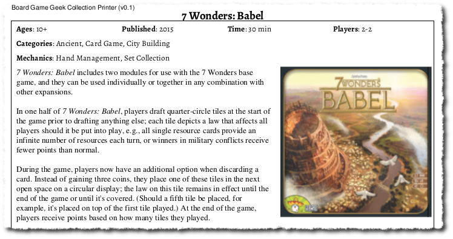
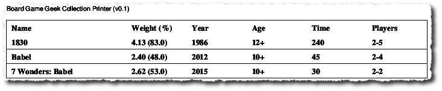
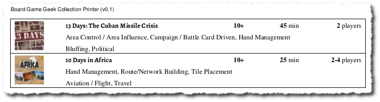

# About

**gamereporter** allows you to generate reports for a list of game-like
objects; typically boardgames whose data can be sourced from 
[boardgamegeek](http://www.boardgamegeek.com).

# Background

Many boardgame owners use the [boardgamegeek](http://www.boardgamegeek.com) 
database to track their games.  Extracting information out of the site, in a 
readable or reusable format, is not always straightforward.  This program allows 
the generation of such reports, with varying degrees of customisation.

# Usage

The `report.py` program can be used to generate a report of game details, or
a game summary (by default, into a file called `games.pdf`, or `games.xls`).

To see the program options, run:

    python report.py --help

Be aware that accessing game details from BGG can be a slow process... a report
with dozens - or even hundreds! - of games **will** take some time to create.

## Dummy Report

A test, or "debug", run with progress display, but requiring no access to 
boardgamegeek.com, with output going to a file called `dummy.pdf`:

    python report.py -d -p -f dummy.pdf

## PDF Reports

A 'real' example, to create a detailed PF report of 5 games, while showing 
progress, for an **imaginary** boardgamegeek user who is called `shurelock`, 
and who is USA-based, would use:

    python report.py -u shurelock -z US -c 5 -p
    
This would look something like:

A summary PDF report for the same user, but with metric options & no display of
progress while running:

    python report.py -u shurelock -c 5 -s summary
    
This would look something like:

    
A compact PDF report for the same user, but with metric options & no progress:

    python report.py -u shurelock -c 5 -s compact
    
This would look something like:

If you know the games you want to get a report on, pass in their boardgamegeek
identity numbers as a list (with a space between each number); for example:

    python report.py -p -g 421 154638 986 320

## XLS Report

An XLS report for the `shurelock` user, with progress displayed:

    python report.py -u shurelock -c 5 -s excel -p

## JSON Reports

Creating a JSON file for the same user, with progress:

    python report.py -u shurelock -c 5 -s json -p
    
The JSON file created can also be re-used an input (for example, you may want to
first edit that file to alter the description given by boardgamegeek):

    python report.py -i games.json -s compact
    
This approach also has the advantage that games will not have to be retrieved
from boardgamegeek each time you run a report; although the game images will be.

# Summary of Features

- Access games by ID from boardgamegeek, or games linked to a user of that site
- Create different types of PDFs with details of each game accessed
- Create an XLS file with summary of each game accessed
- Create a JSON file with details of each game accessed
- Reuse the JSON file to create a report
- Provide some basic parameters (such as fonts and page sizes to be used)

The existing code can, of course, be modified to create other layouts and report
on other game details.

# Requirements

This application assumes you are familiar with Python and its usage via the
command-line.  It is also assumed you are familiar with use of git.

**WARNING** This program has only been used and tested under Ubuntu 14.04,
running Python 2.7.

# Installation

Create and activate a [virtualenv](https://virtualenv.pypa.io/en/stable/). 
Clone this application into a directory, change to that directory and run:

    pip install -f requirements.txt

If you want to use the `report.py` program 'as is', you first need to install 
the Alegreya TrueType fonts; see:

- ['AlegreyaSansSC'](http://www.1001freefonts.com/alegreya_sans_sc.font)
- ['Alegreya'](https://fontlibrary.org/en/font/alegreya)

# Credits

Many thanks go to the authors and developers of the following Python 
libraries for making it even possible to create such a reporting tool:
- [`boardgamegeek`](https://github.com/lcosmin/boardgamegeek)
- [`reportlab`](http://www.reportlab.com/opensource/)
- [`xlwt`](https://pypi.python.org/pypi/xlwt)

Also, thanks to the creator of the amazingly attractive Alegreya fonts - 
 Juan Pablo del Peral!

